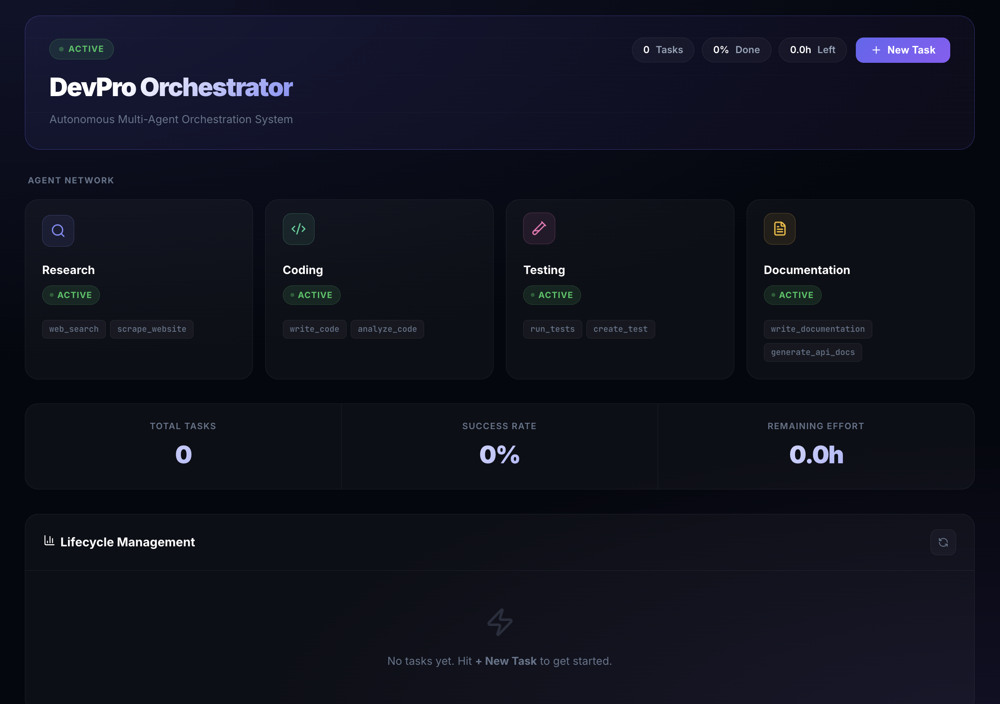
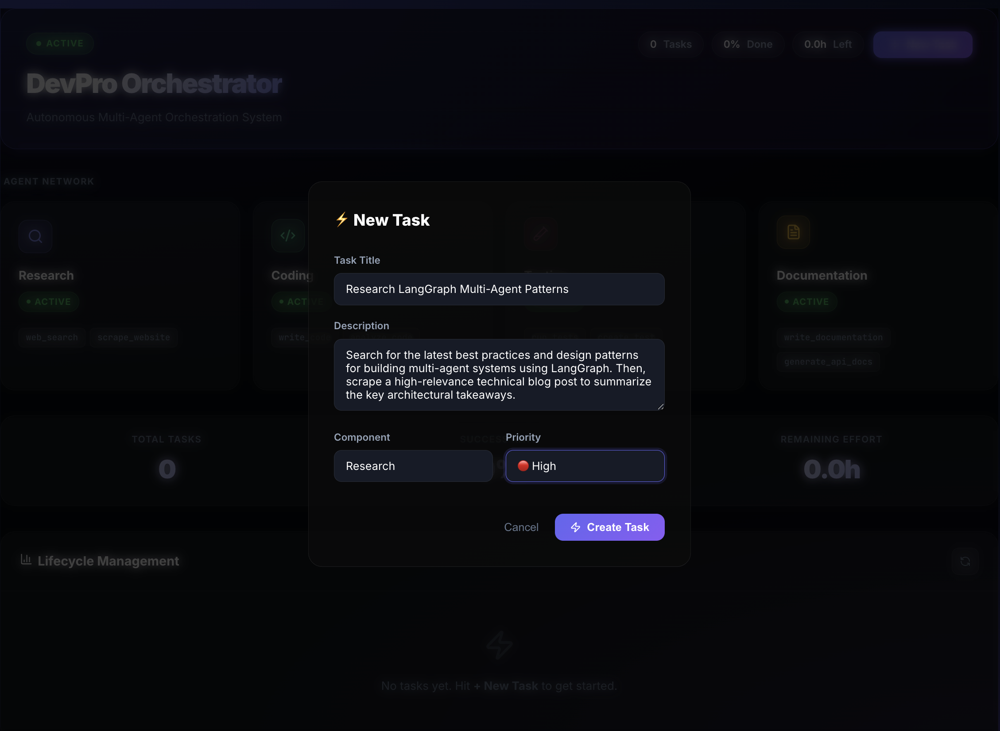

# 🌌 DevPro Orchestrator: The Agentic Network

> **A high-fidelity, multi-agent orchestration system for autonomous research, development, and complex task execution.**

---

## 🚀 Overview

**DevPro Orchestrator** is a next-generation Multi-Agent System (MAS) designed to orchestrate specialized AI agents with precision. Built on **LangGraph Supervisor**, DevPro Orchestrator coordinates a network of expert agents—Research, Coding, Testing, and Documentation—to solve complex, multi-step problems autonomously.

Featuring a **premium, real-time React dashboard**, DevPro Orchestrator provides full visibility into the agentic lifecycle, from task creation to autonomous execution and completion.

---

## 🖼️ Dashboard Preview





---

## ✨ Key Features

- **🔄 Supervisor-Led Orchestration**: Intelligent task routing and coordination powered by LangGraph.
- **🎨 Premium Cyberpunk Dashboard**: A stunning React + Nginx dashboard with real-time status polling and glassmorphism UI.
- **🔍 Deep Research Capabilities**: Integrates **Crawl4AI** for local, high-fidelity web scraping and **Exa** for neural search.
- **🐳 One-Command Deployment**: Fully containerized with Docker Compose for seamless setup.
- **📊 Real-time Monitoring**: Live agent status, task progress tracking, and success metrics.
- **🛡️ Production Hardened**: Built with Pydantic v2 validation, comprehensive error handling, and structured logging.

---

## 🏗️ Architecture

DevPro Orchestrator follows a modern, decoupled architecture:

- **Frontend**: React (Vite) + Lucide Icons + Tailwind-inspired CSS (Vanilla).
- **Backend**: FastAPI (Python 3.12) providing a robust RESTful API.
- **Orchestration**: LangGraph Supervisor managing specialized agents.
- **Proxy**: Nginx as a reverse proxy for unified entry (Port 8080).
- **Storage**: SQLite (SQLModel) for efficient task and progress tracking.

---

## 🚦 Getting Started

### Prerequisites

- **Docker** and **Docker Compose**
- **OpenAI API Key** (or other LLM provider keys)

### ⚡ One-Command Setup

1. **Clone the repository**:
   ```bash
   git clone https://github.com/shemayon/DevPro-Orchestrator.git
   cd DevPro-Orchestrator
   ```

2. **Configure Environment**:
   Create a `.env` file in the root directory:
   ```env
   OPENAI_API_KEY=your_key_here
   EXA_API_KEY=your_exa_key_here  # Optional for research agent
   ```

3. **Launch DevPro Orchestrator**:
   ```bash
   docker-compose up --build
   ```

4. **Access the Dashboard**:
   Open **[http://localhost:8080](http://localhost:8080)** in your browser.

---

## 📂 Project Structure

```text
├── src/
│   ├── agents/          # Specialized expert agents (Coding, Research, etc.)
│   ├── core/            # Common protocols and state management
│   ├── integrations/    # External clients (Crawl4AI, Exa)
│   ├── schemas/         # Pydantic v2 unified data models
│   ├── api.py           # FastAPI REST endpoints
│   ├── supervisor.py    # LangGraph orchestration logic
│   └── task_manager.py  # SQLite-backed task lifecycle manager
├── frontend/
│   ├── src/             # React (Vite) dashboard source
│   └── Dockerfile       # Multi-stage frontend build
├── nginx/
│   └── default.conf     # Reverse proxy configuration
├── docker-compose.yml   # Multi-service orchestration
└── pyproject.toml       # Managed via uv
```

---

## 🛠️ Developer Guide

### Running Locally (Without Docker)

DevPro Orchestrator is managed using **uv** for ultra-fast dependency resolution.

1. Install dependencies: `uv sync`
2. Start the API: `uv run python src/api.py`
3. Start the Frontend: `cd frontend && npm install && npm run dev`

---

## 📄 License

This project is licensed under the MIT License - see the [LICENSE](LICENSE) file for details.


